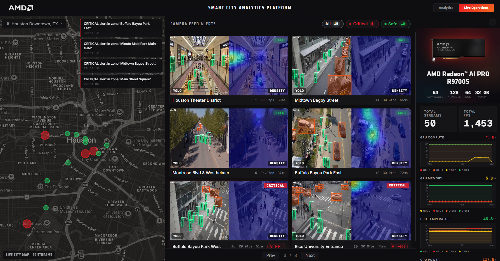
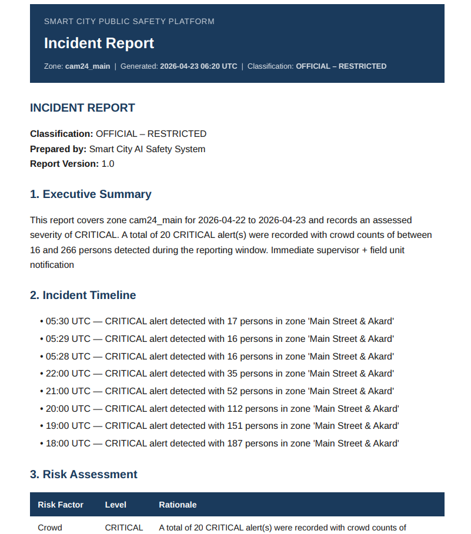

# Smart City - Public Safety

**On‑Premise GenAI Solution for Real‑Time Crowd Intelligence and Incident Reporting**

*Built for city operations centers on 2‑GPU and 4‑GPU AMD Radeon AI PRO R9700S reference deployments with the AMD ROCm 7.2 stack.*



---

## Table of Contents

- [Introduction](#introduction)
- [Key Features](#key-features)
- [Prerequisites](#prerequisites)
- [Deploying the Solution](#deploying-the-solution)
- [User Interface and Flow](#user-interface-and-flow)
- [Agents](#agents)
- [Operations](#operations)
- [Advanced Configuration](#advanced-configuration)
- [Known Issues](#known-issues)
- [Documentation](#documentation)

---

## Introduction

City operations teams monitor hundreds of CCTV cameras across public spaces, transport hubs, and event venues — but most existing systems are CPU‑bound, capped at 10–15 streams, and surface only raw counts. Operators learn about overcrowding **after the fact** and have no way to tie what they see back to city policy or SOPs.

This solution delivers a **unified, on‑premise crowd intelligence system** that continuously monitors camera networks to detect overcrowding, abnormal movement, and emerging risks. It transforms live video into structured alerts and uses a multi‑agent AI layer to generate clear operational summaries — what happened, where, severity, and recommended next steps — all with full data sovereignty.

---

## Key Features


| Feature                                | Description                                                                                                                                              |
| -------------------------------------- | -------------------------------------------------------------------------------------------------------------------------------------------------------- |
| **GPU‑Accelerated Video Intelligence** | 50 RTSP streams with YOLOv26 + DM‑Count on 2× or 4× AMD Radeon R9700S (ROCm + MIGraphX). |
| **GAIA Agentic Intelligence**          | AMD GAIA framework orchestrates Investigator (TimescaleDB) + SOP Advisor (Milvus RAG) for context‑aware incident analysis with policy‑grounded summaries |
| **Real‑Time Alerting System**          | Automatic alerts on threshold breach with zero delay; live‑stream auto‑popups with heatmaps — no operator intervention needed                            |
| **On‑Prem ROCm‑Optimized LLM Serving** | `Qwen3-30B-A3B-GGUF` via Lemonade Server for local report generation, retrieving policy + history for grounded, auditable outputs                        |
| **City‑Scale Awareness Metrics**       | Unified dashboard: live map view with auto‑highlighted critical zones; real‑time analytics for streams, latency, crowd metrics, and system KPIs          |


---

## Prerequisites

This solution was deployed and tested on the following hardware:

**Hardware**

| Component      | Specification                                         |
| -------------- | ----------------------------------------------------- |
| **CPU**        | AMD EPYC / Ryzen Threadripper PRO, 96 cores          |
| **GPU**        | 2× or 4× AMD Radeon AI PRO R9700S (32 GB HBM each, gfx1201) |
| **System RAM** | 256 GB DDR5                                           |
| **Storage**    | 2 TB NVMe SSD                                         |

**Software**

| Component            | Version                  |
| -------------------- | ------------------------ |
| **Operating System** | Ubuntu 22.04 LTS or 24.04 LTS |
| **Linux Kernel**     | 6.17.0-29-generic        |
| **Docker Engine**    | 24.0+                    |
| **Docker Compose**   | v2.20+                   |
| **ROCm**             | 7.2.0                    |

---

## Deploying the Solution

### 1. Clone the repository

```bash
git clone <repository-url>
cd smartcity-public-safety
```

---

### 2. Verify ROCm and GPU visibility

```bash
rocm-smi
```

---

### 3. Stage demo videos (optional)

The repository includes a sample `videos/` directory that the `rtsp-input-publisher` loops onto MediaMTX so the pipeline has RTSP traffic. To use your own clips:

```bash
cp /path/to/your/clips/*.mp4 videos/
```

> [!NOTE]
> The publisher sorts `videos/*.mp4` alphabetically and assigns them to `STREAM_COUNT` streams round-robin.

---

### 4. Prepare the Lemonade host cache (one‑time)

The Lemonade Server downloads the `Qwen3-30B-A3B-GGUF` weights (~17.7 GB) on first start and persists them to bind‑mounted host directories so subsequent boots reuse the cache. Create the cache directories with the correct ownership before the first `docker compose up`:

```bash
sudo mkdir -p /opt/smartcity/lemonade/cache /opt/smartcity/lemonade/recipe /opt/smartcity/lemonade/llama
sudo chown -R $USER:$USER /opt/smartcity/lemonade
```

---

### 5. Prepare the YOLOv26 ONNX model

Before running `setup.sh`, provide the YOLOv26 ONNX model at the path expected
by the runtime:

```text
smart_city/models/yolo26s-384-dynamic.onnx
```

This repository does not install `ultralytics`, download YOLOv26 weights, or export the model during setup. Follow
[yolo26_onnx_export.md](docs/yolo26_onnx_export.md) to download the model you are licensed to use, export it to ONNX, and place it at the required path.

---

### 6. Start the stack

The recommended path is the guided `setup.sh` script — it writes and updates `.env` (including all required secrets such as `HF_TOKEN` and `POSTGRES_PASSWORD`), copies demo videos into `videos/`, downloads the LLM model weights, selects the appropriate 2‑GPU or 4‑GPU profile, verifies the YOLOv26 ONNX file is present, and builds and starts everything:

```bash
./setup.sh
```

If `.env` is already configured the way you want and you just need to (re)build and launch, you can skip the wizard and run Compose directly:

```bash
docker compose up -d --build
```

Either path brings up:

- **Infrastructure**: TimescaleDB, etcd, RustFS, Milvus, Prometheus, MediaMTX
- **AI services**: TEI embeddings, Lemonade LLM
- **Application**: Analytics pipeline, RTSP publisher, FastAPI, React frontend

> [!NOTE]
> First boot can take **5–10 minutes** while images build, ROCm initializes, and the LLM weights load. Check progress with `docker compose ps`.

---

### 7. Verify deployment

```bash
docker compose ps

# API health
curl http://localhost:5173/api/v1/health

# Stream list (live counts)
curl http://localhost:5173/api/v1/streams
```

---

### 8. Access the application

Use one of the following based on where the stack is running:

<ol>
  <li>
    <strong>Remote server deployment (access over SSH)</strong>
    <p>Forward both browser-facing ports — <code>5173</code> (dashboard UI) and <code>8189</code> (WebRTC ICE-TCP).</p>
    <ol type="i">
      <li>
        <strong>VS Code Ports panel</strong>
        <ol type="a">
          <li>Open the Command Palette (<code>Ctrl+Shift+P</code> / <code>Cmd+Shift+P</code>).</li>
          <li>Select <strong>Forward a Port</strong>.</li>
          <li>Add <code>5173</code>, then repeat for <code>8189</code>.</li>
          <li>Open <a href="http://localhost:5173">http://localhost:5173</a> locally.</li>
        </ol>
      </li>
      <li>
        <strong>SSH local port forwarding</strong>
        <ol type="a">
          <li>Run:<pre><code>ssh -L 5173:localhost:5173 \
    -L 8189:localhost:8189 \
    &lt;user&gt;@&lt;remote_host&gt;</code></pre></li>
          <li>Open <a href="http://localhost:5173">http://localhost:5173</a> locally.</li>
        </ol>
      </li>
    </ol>
  </li>
  <li>
    <strong>Local deployment (same workstation)</strong>
    <ol type="a">
      <li>No port forwarding is required.</li>
      <li>Open <a href="http://localhost:5173">http://localhost:5173</a>.</li>
    </ol>
  </li>
</ol>

> [!NOTE]  
> Pipeline initialization typically takes 3–5 minutes, which may delay video streams from loading.

---

## User Interface and Flow

The entire experience lives behind a single URL — [http://localhost:5173](http://localhost:5173). No sign‑in, no role gates; the dashboard loads straight into the live operations view.

### 1. Landing page

<div align="center">
  
  <p><em>Live Operations View</em></p>
</div>

Once the dashboard opens you can:

- **View live GPU metrics** — utilization, VRAM, temperature, and power for each AMD Radeon AI PRO R9700S, refreshed continuously.
- **Switch cities via the dropdown** — pick **Austin**, **Dallas**, or **Houston** to recenter the map and load that city's hotspots. Hover over any hotspot to view a detailed tooltip containing the density heatmap and YOLOv26 detection results.
- **Watch processed camera video** — each tile displays real-time YOLOv26-based person and vehicle detection overlays, along with a DM-Count density heatmap representing crowd intensity. Additionally, each stream includes key performance metrics such as frames per second (FPS), people count, and latency.
- **Page through cameras** — use the pagination control under the camera grid to walk through the next set of streams without leaving the map.

---

### 2. Auto‑Popup on Critical Alert

<div align="center">
  
  <p><em>Threshold breach instantly surfaces the live feed with a heatmap overlay</em></p>
</div>

When any zone breaches its CRITICAL threshold the corresponding stream auto‑surfaces, the heatmap is rendered on top of the frame, an alert banner appears, and the map marker pulses red.

---

### 3. Analytics Page

<div align="center">
  
  <p><em>Analytics dashboard view</em></p>
</div>

Open the **Analytics** page from the top navigation to see the rolling **30‑day** view:

- Aggregated KPIs across all monitored zones for the particular city selected from the dropdown and cameras for the last 30 days.
- A **crowd‑count graph over time** — pick a stream and a time range to inspect peaks, troughs, and recurring patterns.
- Weekly heatmap, trend, and pattern panels for deeper investigation.

---

### 4. Report Generation

Select a zone for the selected city and the time duration for the incident report and click **Generate Report**. The Orchestrator Agent invokes the Investigator (TimescaleDB evidence) and the SOP Advisor (policy excerpts from Milvus); Lemonade synthesizes a structured Markdown report and WeasyPrint renders the PDF you can download.

<div align="center">
  
  <p><em>AI incident summary</em></p>
</div>

<div align="center">
  
  <p><em>Downloaded PDF report</em></p>
</div>

End‑to‑end report generation takes ~60–120 s on local Lemonade.

---

## Agents


| Agent            | Role                                                                                          |
| ---------------- | --------------------------------------------------------------------------------------------- |
| **Orchestrator** | Single entry point; delegates to Investigator + SOP Advisor and synthesizes the LLM prompt    |
| **Investigator** | Pulls alerts, density trends, severity timelines, and recurring patterns from TimescaleDB     |
| **SOP Advisor**  | Retrieves policy and SOP excerpts via top‑k semantic search over Milvus (`bge-small-en-v1.5`) |


> [!TIP]
> See [docs/design.md](docs/design.md#agent-architecture) for full agent diagrams, tool boundaries, and protocols.

---

## Operations

### Logs

```bash
docker compose logs -f                 # all services
```

### Stopping

```bash
docker compose down                    # stop everything
docker compose down -v                 # stop and remove volumes (destroys data)
```
---

## Advanced Configuration

Full reference of every variable understood by the stack:

| Variable                      | Default                                                         | Required | Description                                                            |
| ----------------------------- | --------------------------------------------------------------- | -------- | ---------------------------------------------------------------------- |
| `POSTGRES_USER`               | `smartcity`                                                     | Yes      | TimescaleDB username                                                   |
| `POSTGRES_PASSWORD`           | generated by setup                                              | Yes      | TimescaleDB password                                                   |
| `POSTGRES_DB`                 | `smartcity_db`                                                  | Yes      | TimescaleDB database name                                              |
| `DATABASE_URL`                | set in `.env`                                                   | Yes      | Full TimescaleDB connection string used by the API                     |
| `MILVUS_HOST` / `MILVUS_PORT` | `milvus` / `19530`                                              | Yes      | Vector DB host and port                                                |
| `EMBED_BASE_URL`              | `http://vllm-embed:8000`                                        | No       | TEI embeddings endpoint (leave empty to disable RAG)                   |
| `EMBED_MODEL`                 | `BAAI/bge-small-en-v1.5`                                        | No       | HuggingFace model id served by the TEI embedding container             |
| `VLLM_BASE_URL`               | `http://lemonade:13305`                                         | Yes      | LLM endpoint — override to point at OpenRouter or an external vLLM     |
| `LLM_MODEL`                   | `user.Qwen3-30B-A3B-UD-Q4_K_XL`                                                 | Yes      | Active LLM model id                                                    |
| `VLLM_SERVED_MODEL_NAME`      | `user.Qwen3-30B-A3B-UD-Q4_K_XL`                                                 | No       | Model name advertised by vLLM when used as the alternative backend     |
| `LEMONADE_MODEL`              | `user.Qwen3-30B-A3B-UD-Q4_K_XL`                                                 | No       | Model name pulled by Lemonade Server                                   |
| `LEMONADE_CHECKPOINT`              | `unsloth/Qwen3-30B-A3B-GGUF:UD-Q4_K_XL`                                                 | No       | Model to be loaded by Lemonade Server                                   |
| `LEMONADE_LLAMACPP_BACKEND`   | `rocm`                                                          | Yes      | Lemonade llama.cpp backend (use `rocm` for AMD GPUs)                   |
| `LLM_API_KEY`                 | *empty*                                                         | No       | Required only when `VLLM_BASE_URL` points at OpenRouter                |
| `HF_TOKEN`                    | *empty*                                                         | Yes      | HuggingFace token used to download gated weights / Lemonade cache      |
| `ROCR_VISIBLE_DEVICES`        | `0,1` or `0,1,2,3`                                              | Yes      | ROCm device mask for the selected GPU profile                          |
| `HSA_OVERRIDE_GFX_VERSION`    | `12.0.1`                                                        | Yes      | Required for `gfx1201` (Radeon AI PRO R9700S)                          |
| `YOLO_GPU_ID`                 | profile default                                                 | Yes      | GPU index assigned to YOLOv26 inside the pipeline container            |
| `DMCOUNT_GPU_ID`              | profile default                                                 | Yes      | GPU index assigned to DM‑Count inside the pipeline container           |
| `LEMONADE_GPU_ID`             | profile default                                                 | Yes      | GPU index assigned to the Lemonade LLM container                       |
| `NUM_GPUS`                    | `2` or `4`                                                      | Yes      | Active supported GPU profile                                           |
| `STREAM_COUNT`                | `50`                                                            | Yes      | Concurrent RTSP streams (demo default)                                 |
| `DENSITY_DISPLAY_STREAMS`     | `50`                                                            | Yes       | How many streams render a DM-Count heatmap overlay (capped at `STREAM_COUNT`) |
| `PIPELINE_STATS_FILE`         | `/pipeline_stats/pipeline_stats.json`                           | No       | Pipeline stats path (shared Docker volume — do not change)             |
| `INPUT_BASE_RTSP`             | `rtsp://mediamtx:8554/cam`                                      | No       | Base RTSP URL the input publisher writes streams to                    |
| `MEDIAMTX_HOST`               | `mediamtx`                                                      | No       | MediaMTX hostname used by the pipeline (override for external MediaMTX) |
| `REALTIME_INPUT`              | `1`                                                             | No       | Set `0` to push video as fast as possible (testing only)               |
| `SIMULATE_RETIRE_AFTER_DAYS`  | `7`                                                             | No       | Days of real data before simulator data is retired                     |
| `DOCS_INGEST_PATH`            | `./smart_city/docs/policy`                                      | No       | Host path for policy PDFs/Markdown ingested into Milvus                |
| `RTSP_CAM*_URL`               | *example*                                                       | No       | RTSP URLs for real cameras (e.g. `RTSP_CAM1_URL`, `RTSP_CAM2_URL`, …) |
| `PUBLIC_WEBRTC_HOSTS`         | `127.0.0.1,localhost`                                           | No       | Hostnames MediaMTX advertises for WebRTC ICE candidates                |
| `LOG_LEVEL`                   | `INFO`                                                          | No       | Backend log verbosity                                                  |

---

## Known Issues

### Application

- **Reports first generation is slow** — 60–120 s on local Lemonade due to model warm‑up.
- **Browser occasionally appears stuck** — if the dashboard freezes or a panel stops updating, perform a hard refresh (`Ctrl+Shift+R` / `Cmd+Shift+R`) to recover.

### Infrastructure

- **Lemonade cold‑start** — first launch of the LLM container can take 5–10 min on a cold GPU as `Qwen3-30B-A3B-GGUF` loads.

---

## Documentation


| Document                              | Description                                                         |
| ------------------------------------- | ------------------------------------------------------------------- |
| **[Release Notes](RELEASE_NOTES.md)** | Versioned features, components, and known issues                    |
| **[Design](docs/design.md)**          | Architecture, workflow, agents, data flow, schemas, ports, env vars |


> [!NOTE]  
>
> The policy documents located in `smart_city/docs/policy` and the example videos in `videos` are simulated and illustrative data intended solely for demonstration and testing purposes. These materials do not represent actual organization policies, procedures, or real event footage and should not be relied upon for operational, legal, or real-world decision-making.  
>
> All provided files are supplied "as-is" without warranties. The creators are not responsible for any outcomes or damages resulting from use of these materials outside their intended demonstration context.

---

## Disclaimer (Performance)

Performance varies by hardware and software configurations, including testing conditions, system settings, application complexity, the quantity of data, batch sizes, software versions, libraries used, and other factors. Any performance or benchmarking results referenced in this repository are provided for informational purposes only and should not be interpreted as a guarantee of actual performance.

---

