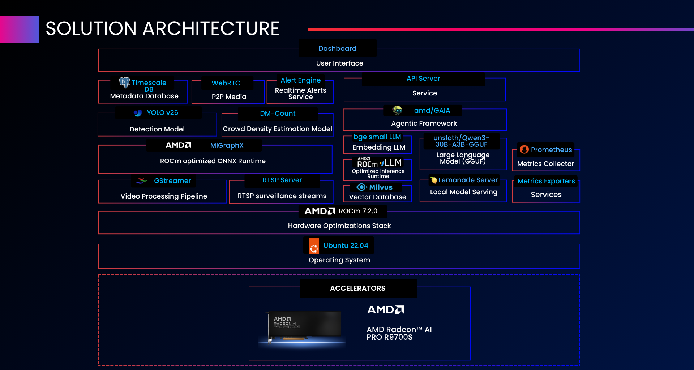
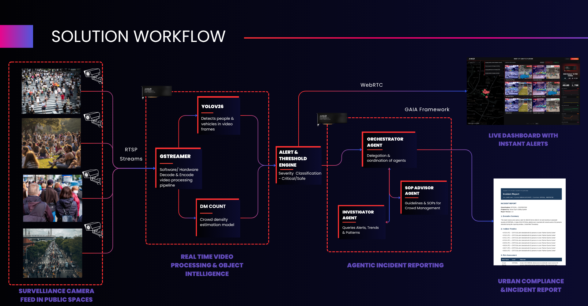

<!--
Copyright Advanced Micro Devices, Inc.

SPDX-License-Identifier: MIT
-->

## Solution Architecture

  
  
<em>Layered solution stack — accelerators → ROCm → frameworks → models → services → dashboard</em>

### Component glossary

| Layer | Component | Role |
|-------|-----------|------|
| **User Interface** | **Dashboard** | React + TypeScript SPA served by Nginx; live city map, processed camera tiles, GPU telemetry, analytics, and report viewer |
| **Application Services** | **API Server** | FastAPI service exposing REST + WebSocket endpoints (alerts, density, reports) |
| | **Realtime Alerts Service** | Background task that fans out threshold breaches to subscribed dashboards over WebSocket |
| | **WebRTC P2P Media** | Browser ↔ MediaMTX WebRTC/WHEP relay carrying the annotated live video |
| | **TimescaleDB Metadata Database** | Time‑series store for `density_samples`, `alerts`, `recurring_patterns`, and report metadata |
| **AI Models** | **YOLO v26 — Detection Model** | Person detection on every decoded frame |
| | **DM‑Count — Crowd Density Estimation** | Spatial density heatmap and crowd‑count regression |
| | **bge‑small‑en‑v1.5 — Embedding LLM** | 384‑dim text embeddings for the policy RAG index |
| | **unsloth/Qwen3‑30B‑A3B‑GGUF** | Local large language model used for incident report synthesis |
| **Inference Runtimes** | **AMD MIGraphX (ROCm‑optimized ONNX Runtime)** | Executes YOLOv26 + DM‑Count on the AMD R9700S |
| | **AMD ROCm vLLM** | Optional alternative LLM backend for higher‑throughput serving |
| | **Lemonade Server** | Default local LLM serving runtime (llama.cpp + ROCm) for the GGUF model |
| **Frameworks** | **AMD GAIA Agentic Framework** | Hosts the Orchestrator / Investigator / SOP Advisor agents |
| | **GStreamer Video Processing Pipeline** | Software decode (`avdec_h264`) / Hardware decode (`vah264dec`) → inference → software encode (`libx264`) |
| | **RTSP Server (MediaMTX)** | Camera ingest and annotated‑stream republishing for WebRTC playback |
| **Storage & Telemetry** | **Milvus Vector Database** | Stores policy/SOP chunk embeddings for the RAG index |
| | **Prometheus Metrics Collector** | Scrapes API, pipeline, GPU, and node exporters |
| | **Metrics Exporters** | `node-exporter` + `amd-device-metrics-exporter` for host and GPU telemetry |
| **Hardware Optimizations** | **AMD ROCm 7.2.0** | GPU compute stack (`gfx1201` for R9700S, `HSA_OVERRIDE_GFX_VERSION=12.0.1`) |
| **Operating System** | **Ubuntu 22.04 LTS (Jammy)** | Validated host OS for the deployment |
| **Accelerators** | **AMD Radeon AI PRO R9700S** | GPU 0 → vision pipeline; GPU 1 → LLM serving (no contention) |

### Architecture highlights

- **GPU‑accelerated inference**: GStreamer software decode (`avdec_h264`) / hardware decode (`vah264dec`) → YOLOv26 + DM‑Count on `MIGraphX` (ROCm 7.2) → software encode (`libx264`) → annotated WebRTC out
- **Agentic incident reporting**: GAIA framework wires Orchestrator → Investigator + SOP Advisor → Lemonade LLM
- **Sovereign data plane**: TimescaleDB for events, Milvus for policy embeddings, Prometheus for telemetry — **all on‑premise**

---

## Solution Workflow

  
  
<em>End‑to‑end flow: surveillance feeds → real‑time video processing → alert engine → agentic incident reporting → live dashboard + Urban Compliance &amp; Incident Report</em>

### Stage descriptions

| Stage | Components | What happens |
|-------|------------|--------------|
| **1. Surveillance ingest** | RTSP cameras in public spaces (intersections, crowd areas, transport hubs, event venues) | N RTSP cameras publish to MediaMTX over TCP |
| **2. Real‑time video processing** | GStreamer pipeline on **GPU 0** | Software decode (`avdec_h264`) \ hardware decode (`vah264dec`) → batched GPU inference (YOLOv26 + DM‑Count via MIGraphX) → software encode (`libx264`) → annotated stream republished to MediaMTX |
| **3. Alert & threshold engine** | Alert engine | Per‑zone density compared against critical thresholds; severity classified `SAFE` / `MEDIUM` / `HIGH` / `CRITICAL`; deduplication + cooldown applied |
| **4. Live dashboard** | WebRTC out → React SPA | Annotated stream surfaced via WebRTC; CRITICAL zones auto‑popup with heatmap overlay |
| **5. Agentic incident reporting** | GAIA agents | Orchestrator invokes Investigator (alert/trend mining over TimescaleDB) + SOP Advisor (policy RAG over Milvus) → Lemonade LLM produces a grounded **Urban Compliance & Incident Report** |

---

### Orchestrator Agent

**Purpose**: Single entry point for incident report generation. Delegates investigation and advice to specialist agents, then synthesizes a unified prompt for the local LLM.

**Workflow**:

1. Accepts a report request (zone, time window, severity context, free‑text question).
2. Calls **Investigator Agent** to gather evidence: alerts, density trends, peak counts, severity timeline.
3. Calls **SOP Advisor Agent** to retrieve policy and SOP excerpts grounded in the incident category.
4. Builds a structured system + user prompt and dispatches it to the Lemonade LLM endpoint.

### Investigator Agent

**Purpose**: Quantitative analyst — pulls hard numbers and timelines from TimescaleDB to ground every report in evidence.

**Outputs**:

- Severity timeline for the requested zone and window
- Peak person count and time of peak
- Trend deltas vs. last hour / day / week
- Recurring‑pattern matches (e.g. "this zone exceeds HIGH every Friday 17:00–19:00")

### SOP Advisor Agent

**Purpose**: Retrieves the most relevant operating procedures and city‑planning guidelines via semantic search over Milvus, so the LLM's recommended actions are always policy‑grounded and auditable.

**Workflow**:

1. Embeds the incident question + investigator evidence into a 384‑dim vector via `bge-small-en-v1.5`.
2. Performs top‑k cosine‑similarity search over `policy_chunks` collection in Milvus.
3. Returns the matched chunks with source document IDs for citation.

---

## Ports Reference

The two ports the operator's browser actually needs — every other service is reverse‑proxied behind the frontend or used internally on the Docker network only.

| Port | Service | Description |
|------|---------|-------------|
| 5173 | frontend | React dashboard (Nginx) — UI, FastAPI, and Swagger all proxied behind this origin |
| 8189 | mediamtx | WebRTC ICE‑TCP path used by the browser to receive live annotated video |

> [!TIP]
> The full list of environment variables, with defaults and required/optional flags, lives in the [Advanced Configuration](../README.md#advanced-configuration) section of README.
